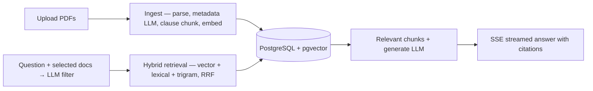

# LeaseClear

A document Q&A system for residential lease agreements that answers with citations, refuses when it doesn't know, and publishes its own accuracy metrics.

**[Live demo →](https://leaseclear.vercel.app)**

## What it does

- Ask questions across a corpus of lease PDFs and get cited answers.
- Click a citation and the source document opens with the exact highlighted clause it came from.
- Ask something the corpus doesn't answer and get an explicit refusal, sometimes paired with the closest related clause, still cited, so you can verify it yourself.
- Select which documents are in scope before asking.
- Get suggested questions for the currently selected documents.
- Try it in demo mode with 8 example leases — no sign-up required.

## Architecture




## Engineering decisions

- Citation IDs like `[doc-slug §3]` (with `§3(1)` collision suffixes) are the join key from answer → chunk → UI highlight. Human and LLM-readable; no opaque UUIDs in the prompt. 
- Clause-aware chunking so retrieval, citations, and click-to-highlight UX align with how leases are 
actually structured. Done with regex over PDF-to-markdown or layout detectors: residential leases are numbered `1. 2. 3. …`, so regex stays deterministic and robust. Missed clauses degrade citations slightly; but they're not catasthropic; the system still holds.
- Pre-retreival LLM filter on extracted landlord / tenant / address metadata as the single biggest quality jump: Chunk search alone misses questions that name a party or address (e.g. "What's John Kim's rent?"); Scoping the right lease early lifts Recall@8 from ~0.80 → 0.98 (more impactful than any hybrid search tweak 
alone).
- Suggested questions generated from the currently selected documents for faster exploration. Cached by document so selection changes don't trigger an LLM call everytime.
- Soft refusals (refusal line plus a related cited clause) are emergent, not prompted. Kept because they stay verifiable.
- `/coprus` living in the repo. Generates synthetic leases from dataclasses + Jinja templates: content is text living in the code editor, which is much easier to edit than pdfs. With edge cases and contradictions planted and documented.
- Answer-match (LLM) as the core eval: does the answer a human reads contain the golden information? If any 
stage fails, this fails.
- Production retrieval is vector+lexical+trigram: both highest recall@8 and MRR. Recall is priositized.
- Unit/integration tests cover deterministic pieces (chunking, citation IDs, fusion, validation, API wiring) and avoid asserting on LLM answer quality, which is the job of the evals.
- SSE streaming: the UI renders as the model generates.

## Evals

Done by scoring the system against a "golden" dataset of 70 questions with known answers + citations (40 answerable, 15 hard, 15 unanswerable).

Golden dataset: [answerable.jsonl](./backend/src/leaseclear/evals/golden/answerable.jsonl) · [hard.jsonl](./backend/src/leaseclear/evals/golden/hard.jsonl) · [unanswerable.jsonl](./backend/src/leaseclear/evals/golden/unanswerable.jsonl)

<!-- eval-report-links:start -->
Full reports: [generation report](./backend/src/leaseclear/evals/reports/eval-generation-161559-20260716.md) · [retrieval report](./backend/src/leaseclear/evals/reports/eval-retrieval-161655-20260716.md)
<!-- eval-report-links:end -->

<!-- eval-generation:start -->
### Generation Summary

| Metric | Score | Target | n | Status |
|---|---|---|---|---|
| Retrieval recall@8 | 96.4% | ≥ 90% | 55 | PASS |
| Faithfulness (LLM) | 100.0% | ≥ 90% | 86 | PASS |
| Citation precision (LLM) | 97.7% | ≥ 90% | 86 | PASS |
| Refusal accuracy | 100.0% | ≥ 93% | 15 | PASS |
| Answer match (LLM) | 96.4% | ≥ 90% | 55 | PASS |
| Hallucination rate (LLM) | 0.0% | ≤ 5% | 86 | PASS |
<!-- eval-generation:end -->
<!-- eval-retrieval:start -->
### Retrieval Summary

| Metric | Winner Strategy | Score |
|---|---|---|
| MRR | vector+lexical+trigram | 0.80 |
| Recall@8 | vector+trigram | 0.98 |
<!-- eval-retrieval:end -->

### Metric cheat sheet

- **Retrieval recall@8** — Golden chunk was retrieved in the top 8 chunks
- **Faithfulness (LLM)** — Answer supported by the retrieved chunks
- **Citation precision (LLM)** — Answer supported by the cited chunks
- **Refusal accuracy** — Correctly refuses when question is unanswerable
- **Answer match (LLM)** — Generated answer matches golden answer
- **Hallucination rate (LLM)** — Claims not supported by retrieved chunks
- **MRR** — How high up is the golden chunk in the retrieved set
- **Recall@8** — Whether the golden chunk is in the first 8 or not


## API overview

- `POST /auth/register`, `/auth/login`, `/auth/google`, `/auth/demo`
- `GET /auth/me`
- `GET`, `POST /documents`
- `DELETE /documents/{document_id}`
- `GET /documents/{slug}/chunks`
- `POST /documents/suggested-questions/query`
- `POST /query` — streams SSE
- `GET /health`

Uploads accept PDF files only. Registration, login, Google authentication, uploads, and queries have per-IP rate limits.


1. Generate

## Run the app locally

### Corpus

From `/corpus`

1. Generate corpus pdf files in `/generated`

```bash
uv sync && uv run python generate.py
```

### Backend

From `/backend`

1. Copy env files and fill in secrets / API keys:
```bash
cp .env.example .env
```

2. Start Postgres, create and seed the app DB:
```bash
uv sync
docker compose up -d
uv run scripts/create_db.py
uv run scripts/seed_db.py
```

3. (Optional) Preview DB 

```bash
uv run scripts/preview_db.py
```

### Frontend

From `/frontend`

1. Copy env files and fill in secrets / API keys:
```bash
cp .env.example .env
```

2. Install dependencies:
```bash
npm run dev
```

### Start app

From `/`

```bash
./dev.sh
```
App at [http://localhost:3000](http://localhost:3000), API at [http://localhost:8000](http://localhost:8000).

## Run the tests

Unit and integration tests live under `backend/tests/`. They use a separate database (`TEST_DATABASE_URL` in `backend/.env`), which is created automatically on first run. From `backend/`:

```bash
docker compose up -d
uv sync
uv run pytest
```

By default, tests marked `real_api` (external API calls) are skipped. To include them:

```bash
uv run pytest -m real_api
```

To run a single file:

```bash
uv run pytest tests/generation/test_validate.py
```

## Run the evals locally

Evals use a separate database (`EVAL_DATABASE_URL` in `backend/.env`). From `backend/`:

1. Start Postgres create and seed the evals db

```bash
docker compose up -d
uv run scripts/create_db.py --eval
uv run scripts/seed_db.py --eval
```

2. Run the evals

```bash
uv run scripts/run_eval.py --mode all --limit 5
```

#### Flags

* `--mode generation|retrieval|all` – retrieval and generation evals are independent. Since retrieval-only evaluations are significantly cheaper, they can be run separately from generation.
* `--limit` – runs evaluations on only the first **N** items from each question set. This is useful for quick, low-cost evaluation runs. Mandatory to help prevent accidental full suite runs.
* `--report-extended` – includes the retrieved chunks sent to the generation LLM. Useful for debugging and manually inspecting generation failures.


