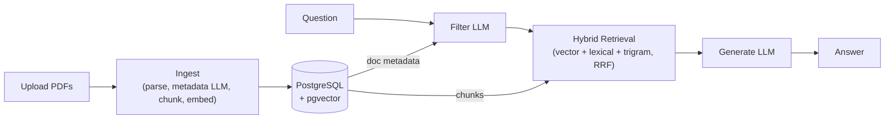

# LeaseClear

A document Q&A system for residential lease agreements that answers with citations, refuses when it doesn't know, and publishes its own accuracy metrics.

**[Live demo →](https://leaseclear.vercel.app)**

## What it does

- Upload residential lease PDFs and ask questions across them.
- Every answer is cited; clicking a citation opens the source document with the relevant clause highlighted.
- Unanswerable questions receive an explicit refusal, optionally with related cited clauses for context.
- Suggested questions that are generated from the selected documents.
- Runs retrieval and generation evaluations against a golden dataset and generates metrics reports. (see [Evals](#evals)).
- Includes a demo with a corpus of 8 synthetic leases (no sign-up required).

## System overview




## Engineering decisions

- **Citation IDs** (`[doc-slug §3]`, `§3(1)` for collisions) are both human- and LLM-readable. Used as source of truth to match answer citations back to their original chunks. 
- **Clause-aware chunking** keeps retrieval, citations, and click-to-highlight aligned with the lease structure. Residential leases are consistently numbered, so deterministic regex parsing was more robust than PDF-to-markdown or layout detectors. Missed clauses in chunking degrade citations slightly; but they're not catasthropic, the system holds.
- **LLM document filtering** narrows the document search space before retrieval when a question references lease metadata such as the landlord, tenant, address, or filename (e.g. "What's *Yuna Kim*'s rent?"), which is a common use case. This improved Recall@8 from **0.80 → 0.98**, a much larger gain than hybrid retrieval tuning alone.
- **Suggested questions** are generated per document selection and cached to avoid unnecessary LLM calls on every selection change.
- **Soft refusals** (a refusal plus a related cited clause) emerged during development and were kept because they remain verifiable while often providing useful context.
- **Synthetic lease generation** (`/corpus`) lives in the repo and generates leases from dataclasses and Jinja templates. Keeping the corpus as code makes it far easier to evolve than manually editing PDFs. It includes documented edge cases and intentional contradictions (e.g. overwriting clauses) to better resemble messy real-world documents.
- **Answer match** is the primary evaluation metric because it captures end-to-end system quality. It evaluates that the final answer is correct.
- **Testing** focuses on deterministic behavior (chunking, citations, retrieval, auth, API wiring) and avoids asserting on LLM answer quality, which is done by the evals.
- **SSE streaming** lets the UI render responses token-by-token which adds faster feedback and better UX.

## Evals

The system is evaluated against a golden dataset of 70 questions (answerable, unanswerable, and hard), each with expected answers and citations. Latest results summary:

<!-- eval-generation:start -->
### Generation

| Metric | Score | Target | n | Status |
|---|---|---|---|---|
| Retrieval recall@8 | 96.4% | ≥ 90% | 55 | PASS |
| Faithfulness (LLM) | 100.0% | ≥ 90% | 86 | PASS |
| Citation precision (LLM) | 97.7% | ≥ 90% | 86 | PASS |
| Refusal accuracy | 100.0% | ≥ 93% | 15 | PASS |
| Answer match (LLM) | 96.4% | ≥ 90% | 55 | PASS |
| Hallucination rate (LLM) | 0.0% | ≤ 5% | 86 | PASS |

_Full report:_ [eval-generation-161559-20260716.md](./backend/src/leaseclear/evals/reports/eval-generation-161559-20260716.md)
<!-- eval-generation:end -->
<!-- eval-retrieval:start -->
### Retrieval

| Metric | Winner Strategy | Score |
|---|---|---|
| MRR | vector+lexical+trigram | 0.80 |
| Recall@8 | vector+trigram | 0.98 |

_Full report:_ [eval-retrieval-161655-20260716.md](./backend/src/leaseclear/evals/reports/eval-retrieval-161655-20260716.md)
<!-- eval-retrieval:end -->

### Metric cheat sheet

- **Retrieval Recall@8** — Whether the golden chunk appears in the top 8 retrieved chunks.
- **Faithfulness (LLM)** — Whether the answer is supported by the retrieved chunks.
- **Citation precision (LLM)** — Whether the cited chunks support the answer.
- **Refusal accuracy** — Whether unanswerable questions are correctly refused.
- **Answer match (LLM)** — Whether the generated answer matches the expected answer.
- **Hallucination rate (LLM)** — Inverse of faithfulness. Claims not supported by retrieved chunks
- **MRR** — How high up is the golden chunk in the retrieved set


## API overview

- `POST /auth/register`, `/auth/login`, `/auth/google`, `/auth/demo`
- `GET /auth/me`
- `GET`, `POST /documents`
- `DELETE /documents/{document_id}`
- `GET /documents/{slug}/chunks`
- `POST /documents/suggested-questions/query`
- `POST /query`
- `GET /health`

Uploads accept PDF files only. Registration, login, Google authentication, uploads, and queries have per-IP rate limits.

## Tech stack

**AI & Retrieval**
- Hybrid retrieval (vector + lexical + trigram, Reciprocal Rank Fusion)
- OpenAI `text-embedding-3-small` embeddings
- Claude for grounded answer generation
- GPT-4o-mini for LLM-as-judge in evals (cross-model)

**Backend**
- FastAPI, PostgreSQL, pgvector
- Pydantic, JWT authentication, Server-Sent Events (SSE)
- uv, Ruff, Pyright

**Frontend**
- Next.js, TypeScript, Tailwind CSS

**Quality**
- pytest (unit & integration)
- GitHub Actions
- Railway (backend), Vercel (frontend)

## Local setup

```bash
# Generate corpus
cd corpus
uv sync
uv run python generate.py

# Backend
cd ../backend
cp .env.example .env
uv sync
docker compose up -d
uv run scripts/create_db.py
uv run scripts/seed_db.py

# Frontend
cd ../frontend
cp .env.example .env
npm install

# Start
cd ..
./dev.sh
```

Frontend: http://localhost:3000  
API: http://localhost:8000

## Tests

Tests live under `backend/tests/` and use a separate database (`TEST_DATABASE_URL`), which is created automatically on first run.

```bash
cd backend
docker compose up -d
uv sync
uv run pytest
```

Run external API tests:

```bash
uv run pytest -m real_api
```

Run a single file:

```bash
uv run pytest tests/generation/test_validate.py
```

## Evals

Evals run against a separate database (`EVAL_DATABASE_URL`).

### Setup

```bash
cd backend

docker compose up -d
uv run scripts/create_db.py --eval
uv run scripts/seed_db.py --eval
```

### Run

```bash
uv run scripts/run_eval.py --mode all --limit 5
```

### Flags

| Flag | Description |
|------|-------------|
| `--mode generation` | Generation evals only |
| `--mode retrieval` | Retrieval evals only |
| `--mode all` | Run both |
| `--limit N` | Evaluate the first `N` questions (required to avoid accidental full runs) |
| `--report-extended` | Include retrieved chunks in the report for debugging |


