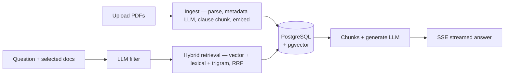

# LeaseClear

A document Q&A system for residential lease agreements that answers with citations, refuses when it doesn't know, and publishes its own accuracy metrics.

**[Live demo →](https://leaseclear.vercel.app)**

## What it does

## What it does

- Upload residential lease PDFs and ask questions across them.
- Every answer is cited; clicking a citation opens the source document with the relevant clause highlighted.
- Unanswerable questions receive an explicit refusal, optionally with related cited clauses for context.
- Scope queries to selected documents.
- Suggested questions are generated from the selected documents.
- Includes a demo with a corpus of 8 synthetic leases (no sign-up required).

## System overview




## Engineering decisions

- Citation IDs like `[doc-slug §3]` (with `§3(1)` collision suffixes) both human and LLM readable. Used to match the answer citations to their corresponding document chunks. 
- Clause-aware chunking so retrieval, citations, and click-to-highlight UX align with how leases aer 
actually structured. Done with regex over PDF-to-markdown or layout detectors: residential leases are numbered `1. 2. 3. …`, so regex stays deterministic and robust. Missed clauses degrade citations slightly; but they're not catasthropic, the system still holds.
- Pre-retreival LLM filter on extracted landlord / tenant / address metadata as the single biggest quality jump: Chunk search alone misses questions that name a party or address (e.g. "What's Yuna Kim's rent?"); Scoping the right lease early lifts Recall@8 from ~0.80 → 0.98 (more impactful than any hybrid search tweak alone).
- Suggested questions generated from the currently selected documents for faster exploration. Cached by document so selection changes don't trigger an LLM call everytime.
- Soft refusals (refusal line plus a related cited clause) are emergent, not initially intentional but were kept because they stay verifiable and provide information that can be useful.
- `/corpus` lives in the repo. Generates synthetic leases from dataclasses and Jinja templates, making content far easier to edit than PDFs. Includes intentional documented edge cases and contradictions.
- Answer-match (LLM) as the core eval: does the answer a human reads contain the golden information? If any stage fails, this fails.
- Unit/integration tests cover deterministic pieces (chunking, citation IDs, fusion, validation, API wiring) and avoid asserting on LLM answer quality, which is done by the evals.
- SSE streaming: the UI renders as the model generates. Adds faster visual feedback and nice UX.

## Evals

## Evals

The system is evaluated against a golden dataset of 70 questions (answerable, unanswerable, and hard), each with expected answers and citations. Latest results summary:

<!-- eval-generation:start -->
### Generation

| Metric | Score | Target | n | Status |
|---|---|---|---|---|
| Retrieval recall@8 | 96.4% | ≥ 90% | 55 | PASS |
| Faithfulness (LLM) | 100.0% | ≥ 90% | 86 | PASS |
| Citation precision (LLM) | 97.7% | ≥ 90% | 86 | PASS |
| Refusal accuracy | 100.0% | ≥ 93% | 15 | PASS |
| Answer match (LLM) | 96.4% | ≥ 90% | 55 | PASS |
| Hallucination rate (LLM) | 0.0% | ≤ 5% | 86 | PASS |

_Full report:_ [eval-generation-161559-20260716.md](./backend/src/leaseclear/evals/reports/eval-generation-161559-20260716.md)
<!-- eval-generation:end -->
<!-- eval-retrieval:start -->
### Retrieval

| Metric | Winner Strategy | Score |
|---|---|---|
| MRR | vector+lexical+trigram | 0.80 |
| Recall@8 | vector+trigram | 0.98 |

_Full report:_ [eval-retrieval-161655-20260716.md](./backend/src/leaseclear/evals/reports/eval-retrieval-161655-20260716.md)
<!-- eval-retrieval:end -->

### Metric cheat sheet

- **Retrieval Recall@8** — Whether the golden chunk appears in the top 8 retrieved chunks.
- **Faithfulness (LLM)** — Whether the answer is supported by the retrieved chunks.
- **Citation precision (LLM)** — Whether the cited chunks support the answer.
- **Refusal accuracy** — Whether unanswerable questions are correctly refused.
- **Answer match (LLM)** — Whether the generated answer matches the expected answer.
- **Hallucination rate (LLM)** — Inverse of faithfulness. Claims not supported by retrieved chunks
- **MRR** — How high up is the golden chunk in the retrieved set


## API overview

- `POST /auth/register`, `/auth/login`, `/auth/google`, `/auth/demo`
- `GET /auth/me`
- `GET`, `POST /documents`
- `DELETE /documents/{document_id}`
- `GET /documents/{slug}/chunks`
- `POST /documents/suggested-questions/query`
- `POST /query` — streams SSE
- `GET /health`

Uploads accept PDF files only. Registration, login, Google authentication, uploads, and queries have per-IP rate limits.

## Local setup

```bash
# Generate corpus
cd corpus
uv sync
uv run python generate.py

# Backend
cd ../backend
cp .env.example .env
uv sync
docker compose up -d
uv run scripts/create_db.py
uv run scripts/seed_db.py

# Frontend
cd ../frontend
cp .env.example .env
npm install

# Start
cd ..
./dev.sh
```

Frontend: http://localhost:3000  
API: http://localhost:8000

## Tests

Tests live under `backend/tests/` and use a separate database (`TEST_DATABASE_URL`), which is created automatically on first run.

```bash
cd backend
docker compose up -d
uv sync
uv run pytest
```

Run external API tests:

```bash
uv run pytest -m real_api
```

Run a single file:

```bash
uv run pytest tests/generation/test_validate.py
```

## Evals

Evals run against a separate database (`EVAL_DATABASE_URL`).

### Setup

```bash
cd backend

docker compose up -d
uv run scripts/create_db.py --eval
uv run scripts/seed_db.py --eval
```

### Run

```bash
uv run scripts/run_eval.py --mode all --limit 5
```

### Flags

| Flag | Description |
|------|-------------|
| `--mode generation` | Generation evals only |
| `--mode retrieval` | Retrieval evals only |
| `--mode all` | Run both |
| `--limit N` | Evaluate the first `N` questions (required to avoid accidental full runs) |
| `--report-extended` | Include retrieved chunks in the report for debugging |


